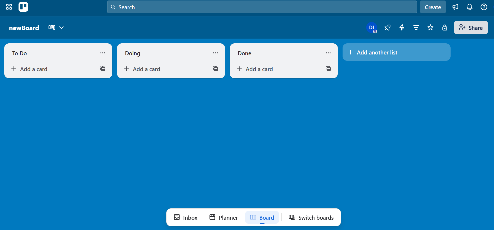

# 📌 Trello API – Newman Collection


This project contains an **API test collection** for [Trello](https://developer.atlassian.com/cloud/trello/rest/), executed with **Postman** and automated using **Newman**.  
The goal is to demonstrate how to test REST APIs in a CI/CD pipeline.

## 📊 Screenshots & Results
### 🚀 Postman Collection Runner


### 📌 Trello Board Example


---

## 📖 Description
- The collection covers **basic Trello operations**:
  - Create a new board
  - Add lists and cards
  - Update card details
  - Delete boards/cards
- Tests are written in **Postman** and exported as a collection  
- **Newman** is used for command-line execution and CI/CD integration  

---

## 🛠️ Technologies
- **Postman** – API request design and testing  
- **Newman** – CLI runner for Postman collections  
- **GitHub Actions** – pipeline automation  
- **Node.js** – dependency management  

---

## ⚙️ Installation
1. **Clone the repository**  
   ```bash
   git clone https://github.com/malkiqmuki/TrelloAPInewmanCollection.git
   cd TrelloAPInewmanCollection

2. **Install dependencies**
   npm install -g newman

3.**Set up environment variables**

Create a trello.postman_environment.json file with your API key and token:

{
  "id": "env-id",
  
  "name": "Trello",
  
  "values":
  [
    { "key": "apiKey", "value": "YOUR_API_KEY", "enabled": true },
    
    { "key": "apiToken", "value": "YOUR_API_TOKEN", "enabled": true },
    
    { "key": "baseUrl", "value": "https://api.trello.com/1", "enabled": true }
  ]
}

▶️ Usage

Run the tests with:

newman run TrelloAPI.postman_collection.json -e trello.postman_environment.json

Example output:

→ Create a new board

  POST https://api.trello.com/1/boards [200 OK]
  
  ✓ Response time < 1000ms
  
  ✓ Board ID is returned

→ Add card to list

  POST https://api.trello.com/1/cards [200 OK]
  
  ✓ Card created successfully

🔄 CI/CD Integration

GitHub Actions workflow (.github/workflows/api-tests.yml) runs the collection on every push:

1.Install Node.js & Newman

2.Run the Postman collection

3.Publish results to the console

📊 Results

Automated validation of Trello REST API endpoints

Regression safety via repeatable Newman runs

CI/CD integration for continuous testing


